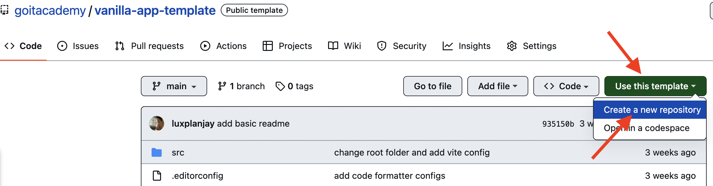

# Vanilla App Template

Цей проект було створено за допомогою Vite. Для знайомства та налаштування
додаткових можливостей [звернись до документації](https://vitejs.dev/).

## Створення репозиторію за шаблоном

Використовуй цей репозиторій організації GoIT як шаблон для створення
репозиторію свого проекту. Для цього натисни на кнопку `«Use this template»` і
обери опцію `«Create a new repository»`, як показано на зображенні.



На наступному етапі відкриється сторінка створення нового репозиторію. Заповни
поле його імені, переконайся, що репозиторій публічний, після чого натисни
кнопку `«Create repository from template»`.


Після того, як репозиторій буде створено, необхідно перейти в налаштування
створеного репозиторію на вкладку `Settings` > `Actions` > `General` як показано
на зображенні.


Проскроливши сторінку до самого кінця, в секції `«Workflow permissions»` обери
опцію `«Read and write permissions»` і постав галочку в чекбоксі. Це необхідно
для автоматизації процесу деплою проекту.


Тепер у тебе є особистий репозиторій проекту, зі структурою файлів та папок
репозиторію-шаблону. Далі працюй з ним, як з будь-яким іншим особистим
репозиторієм, клонуй його собі на комп'ютер, пиши код, роби коміти та відправляй
їх на GitHub.

## Підготовка до роботи

1. Переконайся, що на комп'ютері встановлено LTS-версію Node.js.
   [Скачай та встанови](https://nodejs.org/en/) її якщо необхідно.
2. Встанови базові залежності проекту в терміналі командою `npm install`.
3. Запусти режим розробки, виконавши в терміналі команду `npm run dev`.
4. Перейдіть у браузері за адресою
   [http://localhost:5173](http://localhost:5173). Ця сторінка буде автоматично
   перезавантажуватись після збереження змін у файли проекту.

## Файли і папки

- Файли розмітки компонентів сторінки повинні лежати в папці `src/partials` та
  імпортуватись до файлу `index.html`. Наприклад, файл з розміткою хедера
  `header.html` створюємо у папці `partials` та імпортуємо в `index.html`.
- Файли стилів повинні лежати в папці `src/css` та імпортуватись до HTML-файлів
  сторінок. Наприклад, для `index.html` файл стилів називається `index.css`.
- Зображення додавай до папки `src/img`. Збирач оптимізує їх, але тільки при
  деплої продакшн версії проекту. Все це відбувається у хмарі, щоб не
  навантажувати твій комп'ютер, тому що на слабких компʼютерах це може зайняти
  багато часу.

## Деплой

Продакшн версія проекту буде автоматично збиратися та деплоїтись на GitHub
Pages, у гілку `gh-pages`, щоразу, коли оновлюється гілка `main`. Наприклад,
після прямого пуша або прийнятого пул-реквесту. Для цього необхідно у файлі
`package.json` змінити значення прапора `--base=/<REPO>/`, для команди `build`,
замінивши `<REPO>` на назву свого репозиторію, та відправити зміни на GitHub.

```json
"build": "vite build --base=/<REPO>/",
```

> **Важливо для цього проекту:** оскільки сайт одночасно живе на GitHub Pages
> (як дзеркало/бекап) і на окремому хостингу з власним доменом, тут
> використовуються **два окремі скрипти збірки** — деталі нижче, у розділі
> [«Продакшн-хостинг (hosting.ua)»](#продакшн-хостинг-hostingua).

Далі необхідно зайти в налаштування GitHub-репозиторію (`Settings` > `Pages`) та
виставити роздачу продакшн версії файлів з папки `/root` гілки `gh-pages`, якщо
це не було зроблено автоматично.


### Статус деплою

Статус деплою крайнього коміту відображається іконкою біля його ідентифікатора.

- **Жовтий колір** - виконується збірка та деплой проекту.
- **Зелений колір** - деплой завершився успішно.
- **Червоний колір** - під час лінтингу, збірки чи деплою сталася помилка.

Більш детальну інформацію про статус можна переглянути натиснувши на іконку, і в
вікні, що випадає, перейти за посиланням `Details`.


### Жива сторінка

Через якийсь час, зазвичай кілька хвилин, живу сторінку можна буде подивитися за
адресою, вказаною на вкладці `Settings` > `Pages` в налаштуваннях репозиторію.
Наприклад, ось посилання на живу версію для цього репозиторію

[https://goitacademy.github.io/vanilla-app-template/](https://goitacademy.github.io/vanilla-app-template/).

Якщо відкриється порожня сторінка, переконайся, що у вкладці `Console` немає
помилок пов'язаних з неправильними шляхами до CSS та JS файлів проекту
(**404**). Швидше за все у тебе неправильне значення прапора `--base` для
команди `build` у файлі `package.json`.

## Продакшн-хостинг (hosting.ua)

Основний продакшн-сайт живе не на GitHub Pages, а на власному домені
`dr-yeremenko.com`, розміщеному на хостинг-акаунті **hosting.ua**
(панель [adm.tools](https://adm.tools)). GitHub Pages лишається як другорядне
дзеркало і оновлюється автоматично, а на hosting.ua файли заливаються
**вручну**.

### Чому два скрипти збірки

GitHub Pages роздає сайт з підпапки (`https://<user>.github.io/dr.yeremenko/`),
а hosting.ua — з кореня власного домену (`https://dr-yeremenko.com/`). Через це
шляхи до згенерованих файлів (`--base`) мають бути різні, тому в
`package.json` є два скрипти:

```json
"build": "vite build --base=/",
"build:pages": "vite build --base=/dr.yeremenko/",
```

- **`npm run build`** — для hosting.ua (та для локальної перевірки прод-збірки
  з кореня). Саме цю команду використовуй, коли готуєш файли для заливання на
  hosting.ua.
- **`npm run build:pages`** — використовується автоматично GitHub Actions
  (`.github/workflows/deploy.yml`) при кожному пуші в `main`. Руками її
  запускати не потрібно.

### Як оновити сайт на hosting.ua

1. Виконай `npm run build` — результат з'явиться у папці `dist`.
2. Зайди в панель [adm.tools](https://adm.tools) → «Хостинг» → «Мої сайти» →
   `www.dr-yeremenko.com` → **«Файл-менеджер»**.
3. Відкрий кореневу папку сайту (`/home/<акаунт>/dr-yeremenko.com/www/`).
4. Заливай **вміст** папки `dist` (не саму папку) у цю директорію, заміняючи
   старі файли. Зручно спершу заархівувати `dist` в `.zip`, залити архів і
   розпакувати його прямо у файл-менеджері.

### DNS та домен

- Домен `dr-yeremenko.com` і хостинг куплені в одному кабінеті hosting.ua.
- Канонічна адреса сайту — `https://www.dr-yeremenko.com/` (саме там лежать
  файли і випущений SSL-сертифікат Let's Encrypt).
- Голий домен `dr-yeremenko.com` (без `www`) налаштований через
  **«Веб-редирект»** (розділ «Домени» → `dr-yeremenko.com` → «Веб-редирект»,
  301 на `https://www.dr-yeremenko.com/`), а не через окремий A-запис — щоб
  уникнути дублювання сайту для пошукових систем.
- SSL для `www.dr-yeremenko.com` випущений і оновлюється хостинг-провайдером
  автоматично (Let's Encrypt).

## Як це працює


1. Після кожного пуша у гілку `main` GitHub-репозиторію, запускається
   спеціальний скрипт (GitHub Action) із файлу `.github/workflows/deploy.yml`.
2. Усі файли репозиторію копіюються на сервер, де проект ініціалізується та
   проходить лінтинг та збірку перед деплоєм.
3. Якщо всі кроки пройшли успішно, зібрана продакшн версія файлів проекту
   відправляється у гілку `gh-pages`. В іншому випадку, у лозі виконання скрипта
   буде вказано в чому проблема.
